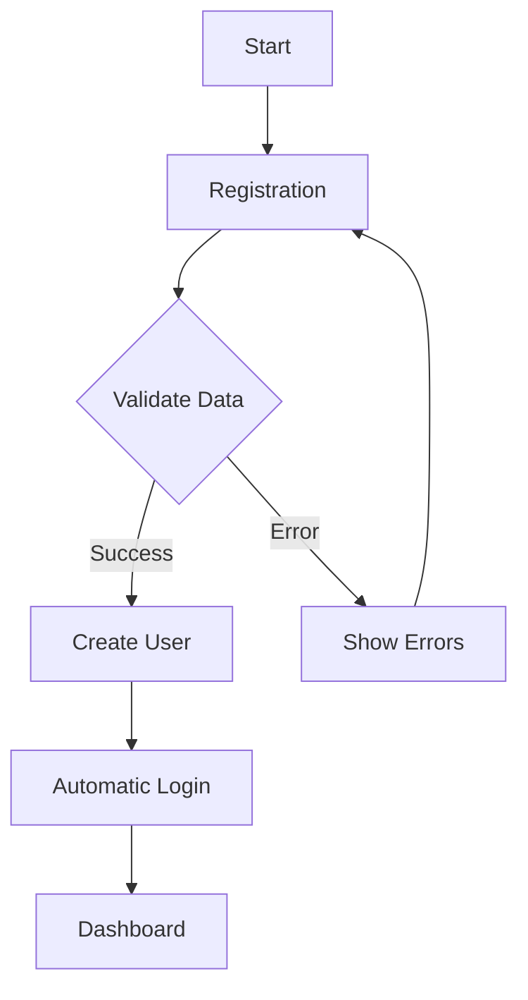
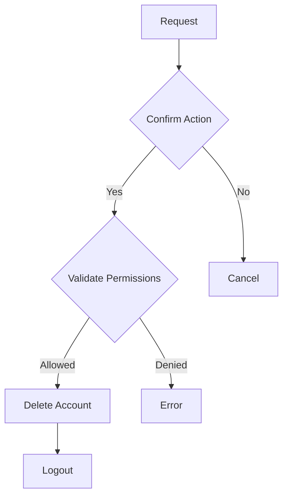

# Business Rules - Team Management

## 📝 Summary

1. [Users and Profiles](#-users-and-profiles)
2. [Authentication and Security](#-authentication-and-security)
3. [User Management](#-user-management)
4. [Restrictions and Validations](#-restrictions-and-validations)

## 👥 Users and Profiles

### User Types

#### 1. Standard User
- Access only to own profile
- Can edit own information (name and email)
- Can change own password
- Can delete own account

#### 2. Administrator (ADMIN)
- All standard user permissions
- Access to complete user list
- Can delete other users (except other administrators)
- Cannot delete own account through user list

### User Data

#### Required Fields
- **Name**: User's full name
- **Email**: Unique email address in the system
- **Password**: Password meeting security criteria
- **Role**: User role (ADMIN or USER)

#### Automatic Fields
- **ID**: System-generated unique identifier
- **Creation Date**: Registration date and time
- **Update Date**: Last modification date and time

## 🔐 Authentication and Security

### User Registration

1. **Registration Validations**
   - Email must not be in use
   - Name must have at least 3 characters
   - Password must meet security criteria

2. **Registration Process**
   - Data validation
   - User creation with default role (USER)
   - Automatic login after registration

### Password Rules

1. **Minimum Criteria**
   - Length: 8-30 characters
   - Must contain uppercase letter (A-Z)
   - Must contain lowercase letter (a-z)
   - Must contain number (0-9)
   - Must contain special character (@$!%?&)

2. **Password Change**
   - Requires current password for confirmation
   - New password cannot be the same as current
   - Must meet all minimum criteria
   - New password confirmation must match

### Session and Authentication

1. **Login**
   - Authentication via email and password
   - "Remember me" option for persistent session

2. **Session**
   - JWT token for authentication
   - Storage in localStorage or sessionStorage

## 👥 User Management

### Administrator Permissions

1. **Viewing**
   - Complete user list
   - User details (name, email, role, creation date)

2. **Allowed Actions**
   - Delete non-administrator users
   - View all user data

### Deletion Restrictions

1. **Protections**
   - Administrators cannot be deleted
   - Admin user cannot delete own account via list
   - Mandatory confirmation for deletion

2. **Deletion Process**
   - Permission validation
   - Action confirmation
   - Redirection after deletion

## ⚡ Restrictions and Validations

### Email Validations

1. **Format**
   - Must be a valid email
   - Cannot contain spaces

2. **Uniqueness**
   - Email must be unique in the system
   - Case-insensitive verification

### Name Validations

1. **Format**
   - Minimum 3 characters
   - Letters, spaces, and accents allowed

### Profile Updates

1. **Editable Fields**
   - Name
   - Email
   - Password (separate process)

2. **Restrictions**
   - Real-time data validation
   - Visual error feedback via toast

## 📊 Metrics and Limits

### System Limits

1. **Users**
   - Maximum users per page: 10
   - Login attempt limit: 5 per minute
   - Block time: 15 minutes

2. **Requests**
   - Rate limiting: 100 requests per minute
   - Request timeout: 30 seconds
   - Maximum payload size: 1MB

### Monitoring Metrics

1. **Security**
   - Failed login attempts
   - Password changes
   - Account deletions

2. **Performance**
   - Average response time
   - Request error rate
   - Resource usage

## 🔄 Workflows

### Registration and Onboarding

### Account Deletion

